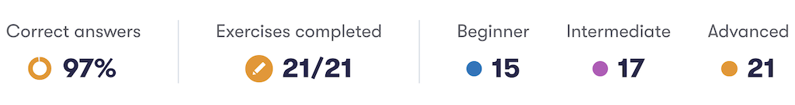
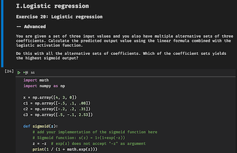

<!-- PROJECT SHIELDS
*** I'm using markdown "reference style" links for readability.
*** Reference links are enclosed in brackets [ ] instead of parentheses ( ).
*** See the bottom of this document for the declaration of the reference variables
*** This is an optional, concise syntax you may use.
*** https://www.markdownguide.org/basic-syntax/#reference-style-links
-->

<!-- HEADER -->

[![Jupyter][jupyter-shield]][jupyter-url]
[![MIT License][license-shield]][license-url]
[![LinkedIn][linkedin-shield]][linkedin-url]

<!--  -->
<svg height="28" width="38" xmlns="http://www.w3.org/2000/svg">
									<g fill-rule="evenodd" fill="#202124">
										<circle cx="24" cy="14" r="14"></circle>
										<circle cx="5" cy="23" r="5"></circle>
									</g>
</svg>

1. [Solutions for BuildingAI problems](#buildingai-solutions)
2. [Building AI course project proposal](#building-ai-course-project-proposal-call-your-mom)
---

# BuildingAI: Solutions

*solutions to programming problems and quizzes*


## Features

[](./building-ai.ipynb)

- All solutions are present and commented in a single [Jupyter Notebook][jupyter-url] file: [`building-ai.ipynb`](./building-ai.ipynb)
- Import a [Jupyter Notebook][jupyter-url] file to local environment or [Google Colab][google-colab-url]
- Run documented cells one by one, see output and read comments

## Installation

1. Clone this repository:
```
$ git clone https://github.com/andrejkurusiov/elementsofAI-buildingAI.git [your-folder-name]
```
2. *(optional)*\* Install [Python](https://www.python.org/downloads/)
3. *(optional)*\* Install packages with `pip`:
```zsh
$ pip install -r requirements.txt
```
4. Open `building-ai.ipynb` and run cells.

(\*) *instead of installing Python locally, you can use online service, such as [Google Colab][google-colab-url].*

## License

Distributed under the [MIT License](./LICENSE).

---

# [Building AI course][buildingai-url] project proposal: call-your-mom

![phone][phone-img-url]\
*Photo by [Annie Spratt](https://unsplash.com/@anniespratt?utm_source=unsplash&utm_medium=referral&utm_content=creditCopyText)*

## Summary

> When you grow up, you live separately from your mom.\
> Because of that, she wants to keep in touch with you.\
> Optimise your calls, so that your mom is always happy!

## Background

Each person who lives separately from his/her parents, needs to keep in touch.\
Since my mom calls frequently, and I sometimes forget to call back her in time, we happen to have misunderstandings.

The problem can be described as following:

- "predict" next time your mom would call you
  and
- remind to call her back just before she was going to call you, so that you make her nice surprise :)

## How is it used?

I plan to collect basic data about communications with another party (e.g. my mom), and based on that make a model which predicts when next incoming call is about to happen.

Therefore the model can be used to not only predict next incoming call, but also to remind you to call your mom back a bit in advance.

Potential solution is generic, as it can be used with any other party, like your wife, your children, or any other party you call back and forth periodically.

## Data sources and AI methods

Data collection can be done by any person interested in the topic, based on own calling experience.

Since every person's communication style is unique, the model would potentially need to be trained for a particular person.

Proposed collection method would be calls log (e.g. a text file) with the following structure:

| data             | format                               |
| :--------------- | :----------------------------------- |
| time             | datetime-stamp                       |
| direction        | [1, 0] in/out                        |
| length           | [minutes] call length                |
| sentiment        | [-1, 0, 1] negative/neutral/positive |
| comment          | for future use                       |
| record separator | \--- or new-line                     |

## Challenges

The project does _not_ solve actual communication nor guarantees that your relations would be any better.\
As a challenge I see the need to collect the data (collecting persistency and amount).\
Choosing correct model is a question for a beginner Machine Learning student.\
Normalising data between weeks/ weekends can be a challenge as naturally there exists a periodic pattern in communications.

## What next?

Next steps would be making data collection easy for user and potentially implementing a (mobile) call reminder.

## Acknowledgments

- The materials from the [course BuildingAI][buildingai-url] are used to the extent to illustrate main tasks of the solutions
- My results are presented in the graphic format from [BuildingAI course web-site][buildingai-url]


<!-- MARKDOWN LINKS & IMAGES -->

[license-shield]: https://img.shields.io/github/license/andrejkurusiov/react-cards-users?style=flat
[license-url]: ./LICENSE
[linkedin-shield]: https://img.shields.io/badge/LinkedIn-Profile-informational?style=flat&logo=linkedin
[linkedin-url]: https://www.linkedin.com/in/andrejkurusiov/
[jupyter-shield]: https://img.shields.io/badge/Jupyter-Notebook-545454.svg?style=flat&logo=jupyter
[jupyter-url]: https://jupyter.org/
[buildingai-url]: https://buildingai.elementsofai.com/
[google-colab-url]: https://colab.research.google.com/notebooks/intro.ipynb
[phone-img-url]: https://images.unsplash.com/photo-1520923642038-b4259acecbd7?ixid=MXwxMjA3fDB8MHxzZWFyY2h8NXx8dGVsZXBob25lfGVufDB8fDB8&ixlib=rb-1.2.1&auto=format&fit=crop&w=400
